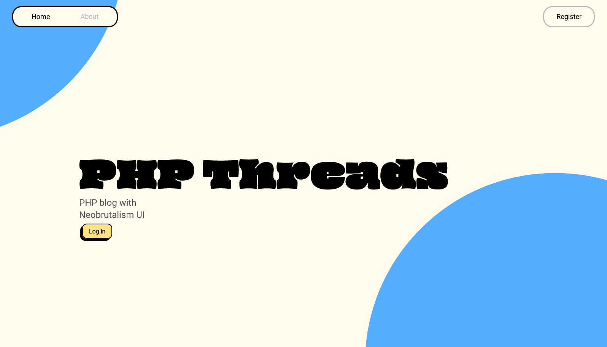
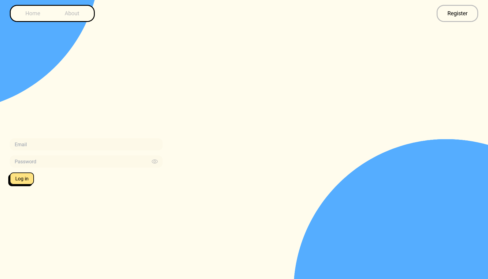
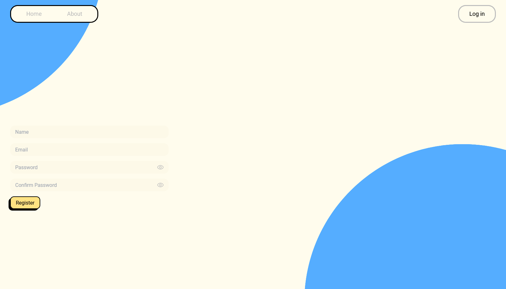
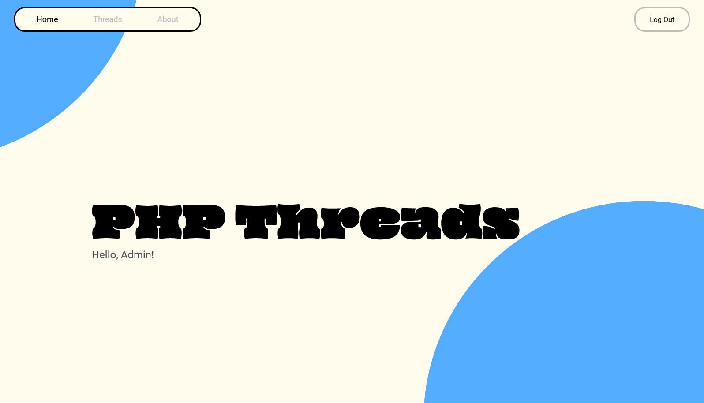
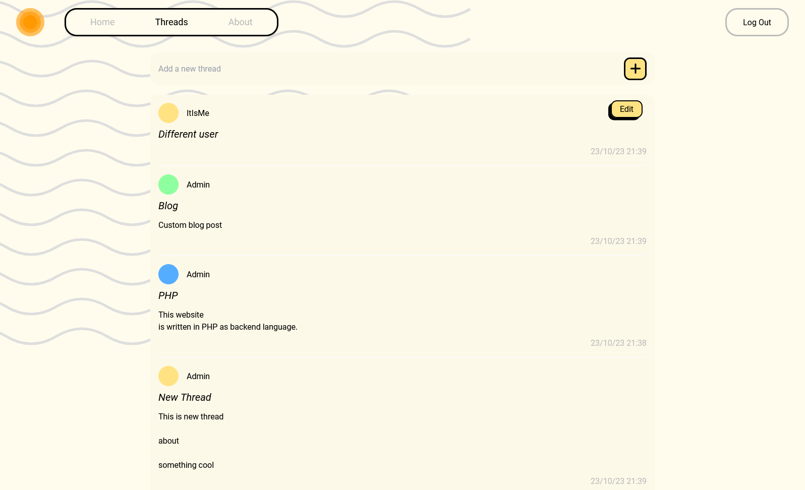
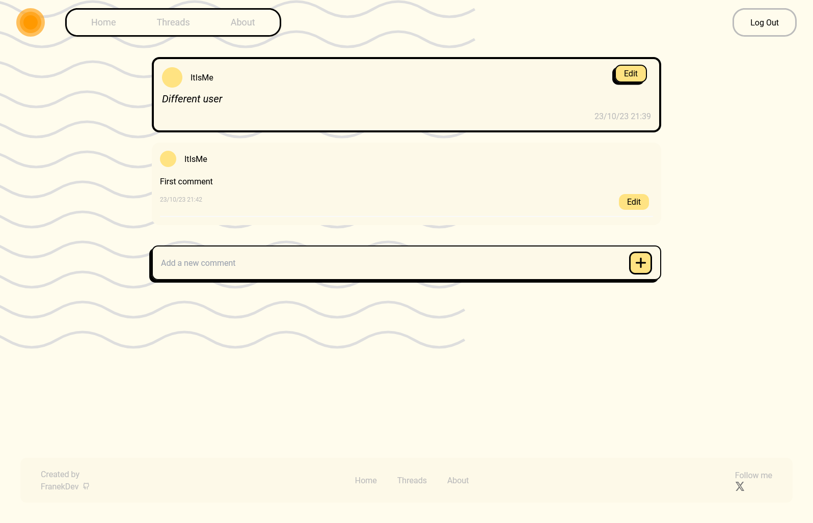
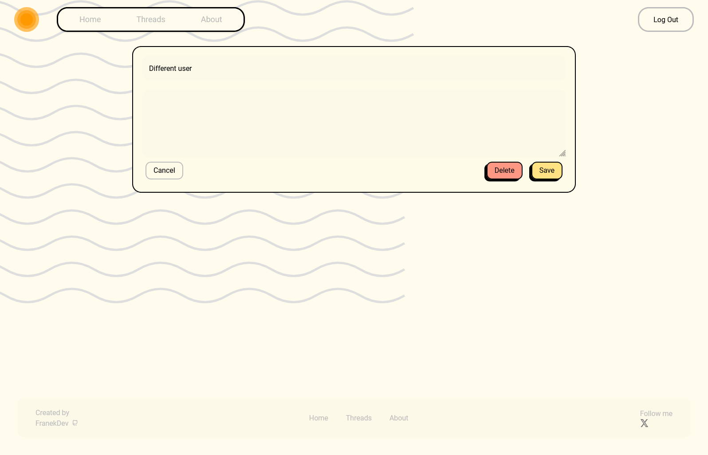
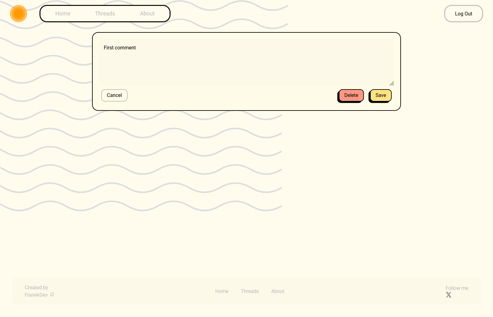
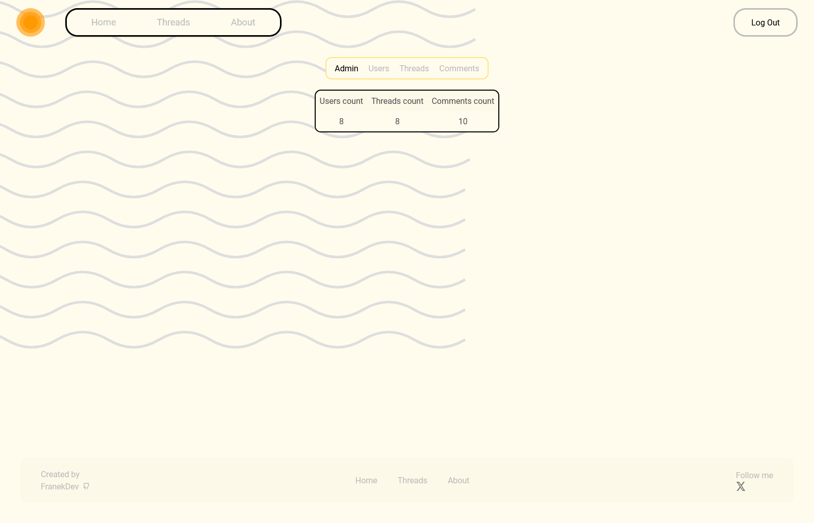

# PHP Blog

### I've developed a PHP-based blog application with a PostgreSQL database and a user interface created using HTML, JavsScript and Tailwind CSS. After registering, users can create new blog posts and add comments. Logged-in users have the ability to perform CRUD (Create, Read, Update, Delete) operations on their posts and comments. Additionally, I've implemented an admin panel that displays user, post, and comment summaries, allowing the administrator to delete this data.  While working on this project, I adhered to the Model-View-Controller (MVC) architectural pattern to ensure a structured and organized codebase.

## UI

### Home page

### Log In page

### Register page

### Home page for logged in user

### Threads page available only for logged in user

### Comments page available only for logged in user

### Paged for editing threads and comments available only for logged in user

### Admin page available only for logged in user with admin role,  this page is only available by direct link (/admin) and is not visible in navbar

